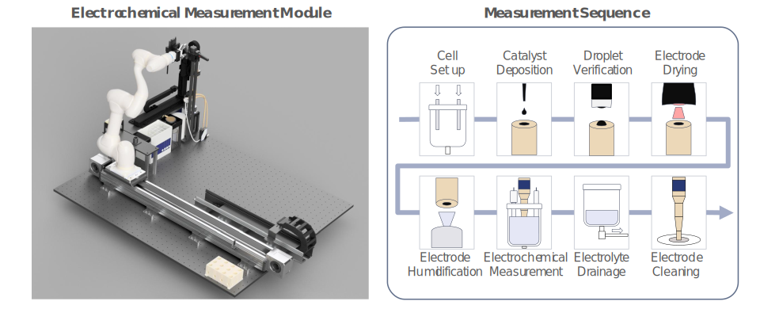

# ElectrochemicalMeasurementModule: Automated RDE Electrochemical Analysis Platform

ElectrochemicalMeasurementModule is a hardware control framework for fully automated Rotating Disk Electrode (RDE) electrochemical analysis. This system integrates 11 hardware devices orchestrated over TCP/IP networking to automate electrode preparation, electrochemical evaluation, and post-processing workflows. Its effectiveness was validated through oxygen evolution reaction (OER) performance evaluation of Ir-based catalyst systems.



## Key Features

- **Fully automated RDE workflow** covering electrode polishing, drying, humidification, electrochemical measurement, and imaging.
- **11 integrated hardware devices** controlled via Serial, Modbus RTU/TCP, SCPI, EC-Lab DLL, and USB protocols.
- **Virtual/Real operation modes** for simulation and testing without physical hardware.
- **Modular device architecture** with unified error handling and structured logging.
- **TCP/IP server node** enabling remote command dispatch and multi-device coordination.
- **Validated on Ir-based ternary catalyst systems** for OER activity and stability evaluation.

## 🗂 Project Structure

```text
ElectrochemicalMeasurementModule/
├── RDEModule_Class.py          # Core orchestration module
├── Module_Node.py              # TCP/IP server entry point (port 54009)
├── Device_Exception.py         # Custom exception handling
├── BaseUtils/                  # TCP communication & JSON utilities
│   ├── TCP_Node.py
│   ├── TCP_Node_batch.py
│   └── Preprocess.py
├── Log/                        # Centralized logging (NodeLogger)
│   └── Logging_Class.py
├── Potentiostat/               # Biologic VSP-3e potentiostat control
│   ├── Potentiostat_Class.py
│   ├── Potentiostat_Params.py
│   ├── kbio/                   # EC-Lab API Python wrappers
│   └── protocol/               # Electrochemical protocol JSON files
├── RDEactuator/                # 3-axis motion controller
├── RDErotator/                 # RDE rotation controller (RC-10K)
├── MFC/                        # Mass flow controller (WIZ-701)
├── Pump/                       # Syringe pump (Next3000FJ)
├── Powerbox/                   # Power distribution (solenoid / IR lamp / humidifier)
├── Sonic/                      # Ultrasonic bath (Sonorex Digitec)
├── Microscope/                 # USB camera & image analysis
├── Polishing/                  # Electrode polishing tool
├── RobotTransferUnit/          # Sample transfer robot
├── Figure/                     # Visualization assets
├── data/                       # Experimental data storage
└── requirements.txt
```

## ⚙️ Usage Instructions

1. **Step 1** — Configure COM ports, IP addresses, and device parameters in `RDEModule_Class.py`.
2. **Step 2** — Start the TCP/IP server node by running `python Module_Node.py`.
3. **Step 3** — Send control commands from a client using the packet format: `jobID/hardware_name/action_type/action_info/mode_type`.
4. **Step 4** — Inspect measurement outputs saved under the `data/` directory.

> All device methods support `mode_type='virtual'` for simulation without hardware.
> See in-code docstrings for parameter details and extension points.

## 🧪 Installation & Requirements

Python 3.8 is required. Install dependencies via conda:

```bash
conda env create -f requirements.txt
conda activate rde_env
```

> **Note:** Biologic EC-Lab software must be installed separately to provide `EClib64.dll` for potentiostat communication.

Key packages include pymodbus, pyserial, pyvisa, opencv-python, numpy, and pandas.

## 📄 License & Contact

This repository is intended for academic and research use only.
For questions, please contact:

**Daeho Kim** — Korea Institute of Science and Technology (KIST)
📧 Email: r4576@kist.re.kr
